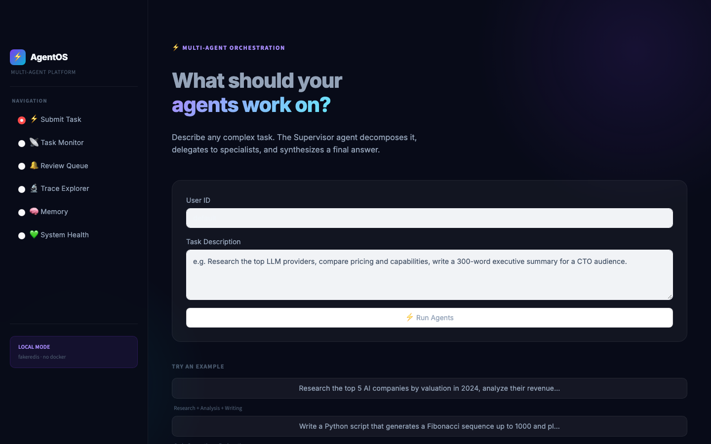
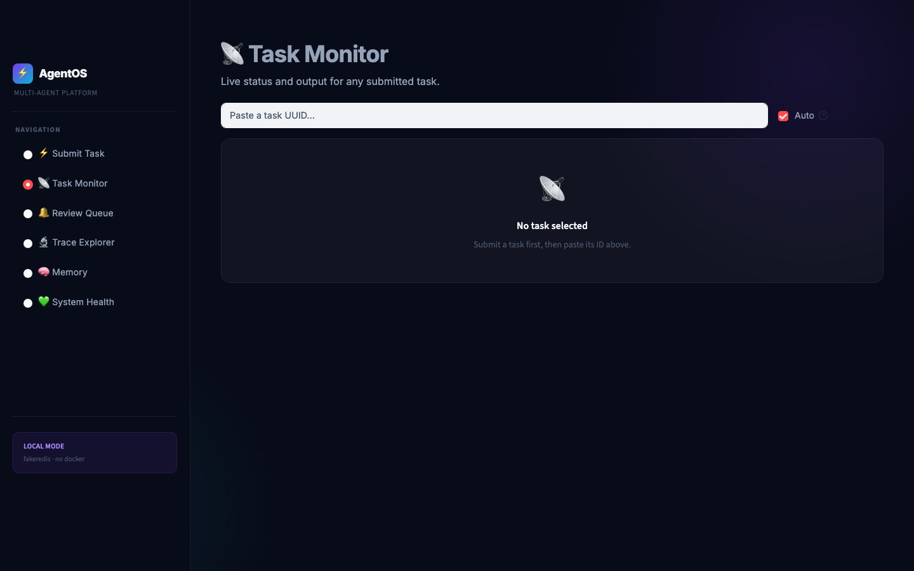
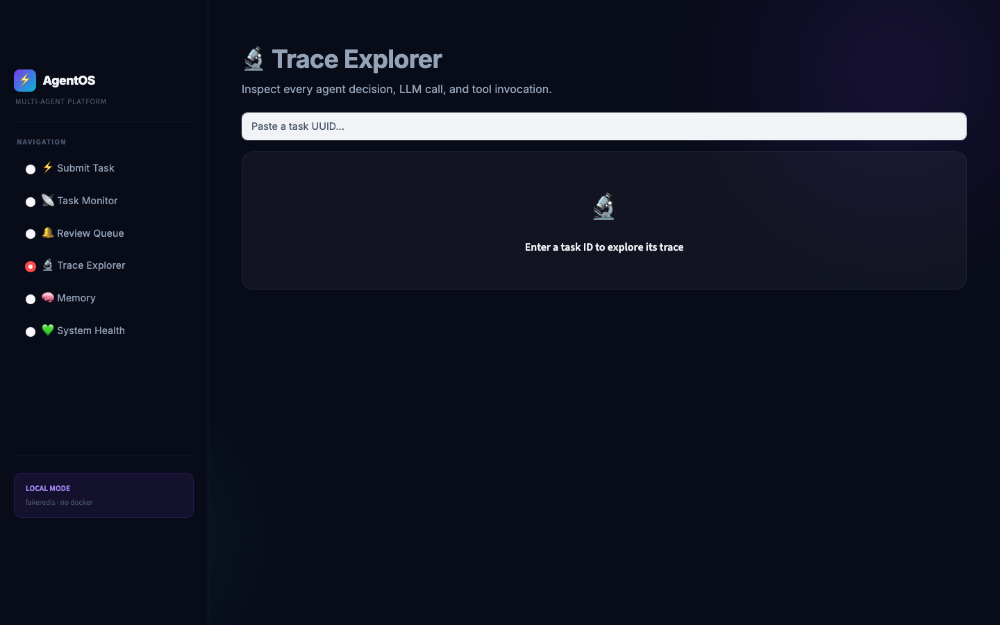
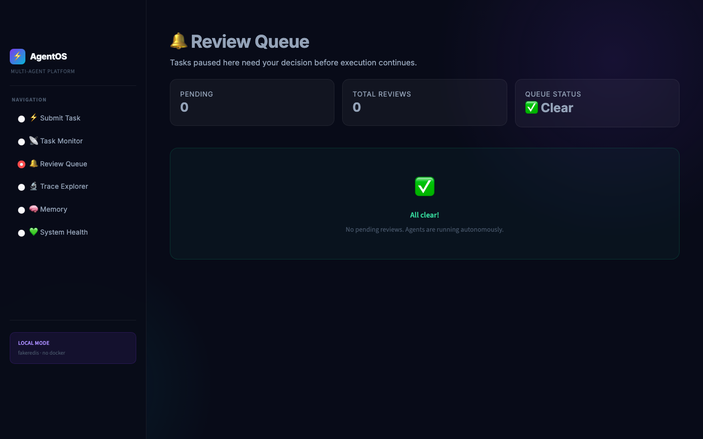

# ⚡ AgentOS Multi-Agent Orchestration Platform

A production-grade multi-agent orchestration system built with **LangGraph**, **FastAPI**, and **Streamlit**. Submit any complex task and watch a team of AI agents decompose, research, analyze, write, and synthesize a final answer with full observability and human-in-the-loop review.



---

## ✨ Features

| Feature | Details |
|---|---|
| **Multi-Agent Graph** | Supervisor → Researcher → Analyst → Writer → Coder → Reviewer pipeline built on LangGraph |
| **Human-in-the-Loop (HITL)** | Agents pause and escalate to a human review queue when confidence is low |
| **Tool Use** | Web search (DuckDuckGo), Python code execution, file read/write, database queries |
| **Persistent Memory** | Semantic long-term memory via ChromaDB short-term working memory via Redis |
| **Full Observability** | OpenTelemetry tracing, per-agent latency, token + cost metrics |
| **Dark Glassmorphism UI** | Streamlit frontend with animated gradient orbs, glass cards, timeline trace explorer |
| **Local Dev Mode** | Runs without Docker using `fakeredis` and background threads instead of Celery |
| **REST API** | FastAPI backend with Swagger docs at `/docs` |

---

## 🖥️ UI Screenshots

### Submit Task
Describe any complex research, analysis, writing, or coding task. The Supervisor agent plans the workflow and delegates to specialists.


### Task Monitor
Track real-time status with auto-refresh. View the synthesized final output when complete.



### Trace Explorer
Inspect every agent LLM call, tool invocation, and decision with per-event latency and a visual timeline.



### Review Queue
Agents escalate here when they need a human decision before proceeding.




---

## 🏗️ Architecture

```
┌─────────────────────────────────────────────────────┐
│                   Streamlit UI (8501)                │
└────────────────────────┬────────────────────────────┘
                         │ HTTP
┌────────────────────────▼────────────────────────────┐
│               FastAPI Backend (8000)                 │
│  /tasks  /reviews  /trace  /health  /memory/stats   │
└────┬──────────────┬──────────────┬───────────────────┘
     │              │              │
  Celery         Redis          ChromaDB
  Workers     (working mem     (semantic
  (agents)     + HITL queue)    memory)
     │
  LangGraph Workflow
  ┌──────────────────────────────────┐
  │  Supervisor → plan + synthesize  │
  │  Researcher → web search         │
  │  Analyst    → data + code        │
  │  Writer     → content creation   │
  │  Coder      → Python execution   │
  │  Reviewer   → quality gate       │
  └──────────────────────────────────┘
```

---

## 🚀 Quick Start 

### Prerequisites
- Python 3.11+
- An Anthropic or OpenAI API key

### 1. Clone & install dependencies

```bash
git clone https://github.com/anikethk28/agent-orchestration.git
cd agent-orchestration

# Create a virtual environment (Python 3.11+)
python -m venv .venv && source .venv/bin/activate

pip install langgraph langchain langchain-openai langchain-anthropic \
            langchain-community structlog rich pydantic pydantic-settings \
            python-dotenv tenacity duckduckgo-search sqlalchemy \
            psycopg2-binary redis celery chromadb fastapi uvicorn \
            streamlit httpx fakeredis opentelemetry-sdk \
            opentelemetry-exporter-otlp opentelemetry-instrumentation-fastapi
```

### 2. Configure environment

```bash
cp .env.example .env
```

Edit `.env` and set at minimum:

```env
# Use Anthropic (recommended)
ANTHROPIC_API_KEY=sk-ant-...
SUPERVISOR_MODEL=claude-sonnet-4-6
SPECIALIST_MODEL=claude-haiku-4-5-20251001
REVIEWER_MODEL=claude-haiku-4-5-20251001

# Or use OpenAI
OPENAI_API_KEY=sk-...
SUPERVISOR_MODEL=gpt-4o
SPECIALIST_MODEL=gpt-4o-mini
REVIEWER_MODEL=gpt-4o-mini
```

### 3. Start the local API server

```bash
PYTHONPATH=. python scripts/local_server.py
```

This starts FastAPI at **http://localhost:8000** with:
- In-memory Redis (`fakeredis`) no Redis install required
- Background threads instead of Celery workers

### 4. Start the UI

```bash
PYTHONPATH=. streamlit run frontend/app.py --server.port 8501
```

Open **http://localhost:8501** in your browser.

---

## 🐳 Full Stack (Docker)

Requires Docker Desktop running.

```bash
cp .env.example .env   # fill in API keys
docker-compose up --build
```

| Service | URL |
|---|---|
| Streamlit UI | http://localhost:8501 |
| FastAPI | http://localhost:8000 |
| API Docs | http://localhost:8000/docs |
| ChromaDB | http://localhost:8001 |

---

## 🧪 Run the CLI Demo

Test the agent graph directly from the terminal:

```bash
PYTHONPATH=. python scripts/demo.py
# or with a custom task:
PYTHONPATH=. python scripts/demo.py --task "Summarize the latest news on quantum computing"
```

---

## 📁 Project Structure

```
agent-orchestration/
├── orchestration/
│   ├── agents/
│   │   ├── base.py              # BaseAgent with LLM routing
│   │   ├── supervisor.py        # Plans + synthesizes
│   │   └── specialists/
│   │       ├── researcher.py    # Web search & fact-finding
│   │       ├── analyst.py       # Data analysis & Python exec
│   │       ├── writer.py        # Content creation
│   │       └── coder.py         # Code generation
│   ├── graph/
│   │   ├── state.py             # AgentState (Pydantic)
│   │   └── workflow.py          # LangGraph state machine
│   ├── api/
│   │   ├── app.py               # FastAPI factory
│   │   ├── routes.py            # REST endpoints
│   │   └── models.py            # Request/response schemas
│   ├── hitl/
│   │   ├── queue.py             # Redis-backed review queue
│   │   └── escalation.py        # Escalation logic
│   ├── memory/
│   │   ├── working.py           # Redis short-term memory
│   │   └── semantic.py          # ChromaDB long-term memory
│   ├── tools/
│   │   ├── registry.py          # Tool registry
│   │   ├── web_search.py        # DuckDuckGo search
│   │   ├── file_ops.py          # Sandboxed file R/W
│   │   ├── code_exec.py         # Python execution sandbox
│   │   └── database.py          # SQL query tool
│   ├── observability/
│   │   ├── tracing.py           # OpenTelemetry setup
│   │   └── metrics.py           # Token/cost/latency tracking
│   └── workers/
│       ├── celery_app.py        # Celery configuration
│       └── tasks.py             # Async agent execution tasks
├── frontend/
│   └── app.py                   # Streamlit dark glassmorphism UI
├── scripts/
│   ├── local_server.py          # Local dev server (no Docker)
│   └── demo.py                  # CLI demo script
├── docker/
│   ├── Dockerfile.api
│   ├── Dockerfile.worker
│   └── Dockerfile.frontend
├── docker-compose.yml
├── pyproject.toml
└── .env.example
```

---

## 🛠️ Tech Stack

| Layer | Technology |
|---|---|
| **Agent Framework** | LangGraph, LangChain |
| **LLMs** | Anthropic Claude, OpenAI GPT |
| **API** | FastAPI + Uvicorn |
| **Task Queue** | Celery + Redis |
| **Vector Memory** | ChromaDB |
| **Database** | PostgreSQL + SQLAlchemy |
| **UI** | Streamlit (dark glassmorphism) |
| **Observability** | OpenTelemetry + in-memory span exporter |
| **Local Dev** | fakeredis, background threads |

---

## 📄 License

MIT
